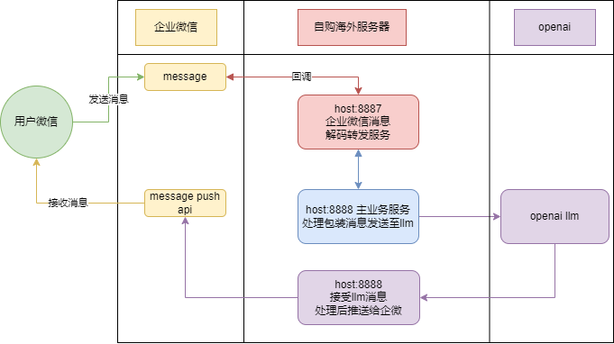
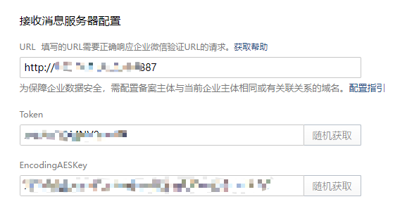

## 使用前提条件
- 需要去注册一个个人[企业微信](https://work.weixin.qq.com/)
- 云服务器 1h2g
    - 如果是自己注册的企业微信，那么其实是不需要域名的，直接ip访问
    - 如果是企业微信已经关联了备案主体，那么需要开一个备案的二级域名解析到服务器，nginx 做下转发就行
- 其它情况，如我域名没备案，但是我就是想用这个域名解析到我的服务器，
  - 那就就可以考虑下面这种 [云函数/网关转发思路，点击查看](./cloudfc.md) 
- 相关网络与服务示意图
  

## 如何使用本项目代码？

### 1. 创建个人企业微信 并获取到对应的 **企业id(corp_id)**

访问 [管理员页面](https://work.weixin.qq.com/wework_admin/frame#profile) ,
可在 我的企业 > 企业信息 > 底部 看到  企业ID


#### 1.1 创建一个企业微信内部应用，并获取到 AgentId 和 Secret

可在 我的企业 > 应用管理 > 自建  看到创建应用，创建一个名为 **ChatGPT** 的应用，并上传应用头像。创建完成后可以在应用详情页看到到 AgentId 和 Secret


### 2. 获取 OpenAI 的 KEY

访问 [Account API Keys - OpenAI API](https://platform.openai.com/account/api-keys) ，点击 `Create new secret key` ，创建一个新的 key ，并保存备用。


### 3. 点击启用消息

- 会进入验证步骤, **先不验证 url** 跳过
- 我们可以 拿到  **Token** 跟 **EncodingAESKey**
- 在[第4步](#42-应用编译启动与配置企业微信应用消息的回调-url)完成后再填写 url 来进行验证


### 4. 在自购服务器上 通过 docker-compose 部署服务，并开启对外的网络端口

**（本项目不提供宝塔面板安装咨询，请各位大佬自行摸索）**

- **前提条件，需要有一个自己的服务器，或者云服务器**
- 执行 docker -v 是否有版本号？
- 执行 docker-compose -v 是否有版本号？

  

- 确认这两个软件都安装后

```shell
# git clone 项目 
git clone https://github.com/whyiyhw/chatgpt-wechat.git

# 完成后进入项目
cd ./chatgpt-wechat

# 接下来进入 chat 后端目录
cd ./chat

# 从备份生成 配置文件
cp ./service/chat/api/etc/chat-api.yaml.bak ./service/chat/api/etc/chat-api.yaml
vim ./service/chat/api/etc/chat-api.yaml
```

- 修改这5个配置项  
  

- 前四个是企业微信 的配置
    - 访问 企业微信-管理员页面 , 可在 我的企业 > 企业信息 > 底部 看到 CorpID
    - DefaultAgentSecret 就是 步骤一中的 Secret
    - Token 跟 EncodingAESKey 可以在[步骤3](#3-点击启用消息)中拿到

- 最后一个 是 openAPI 生成 KEY 的值

---

#### 4.1 重点，[(国外服务器-跳过这一步，点击至下一步)](#42-应用编译启动与配置企业微信应用消息的回调-url) 因为 openai 对于大陆地区的封锁，如果你的服务器在国内，这边提供了两个方案

- （一）自建 代理服务器，然后在 chat-api.yaml 中配置代理服务器的地址，相关的参数在 `chat-api.yaml.complete.bak`
```yaml
Proxy:                                         # 代理配置 （可选）
  Enable: false                                # 是否启用代理，默认为 false（可选）
  Socket5: "{host}:{port}"                     # 代理地址 默认为 127.0.0.1:1080（可选）
  Http: "http://{host}:{port}"                 # 代理地址 默认为空（可选）

# host 是代指你实际代理应用的IP
# 因为本项目使用 docker-compose 搭建，所以一般应该填入代理应用所在宿主机的内网IP
```
如何自建代理，点击查看 [自建代理](./proxy.md)

- （二）使用 cf 自建反向域名代理，然后用的代理域名替换掉,OpenAi 的 Host 即可
```yaml
OpenAi:                                             # openai配置
  Key: "xxxxxxxxxxxxxxxxxxxxx"                      # openai key
  Host: "https://api.openai.com"                    # openai host （可选，使用cf进行反向代理时，修改可用）
```
如何自建反向域名代理，点击查看 [自建反向域名代理](./cf.md)

#### 4.2 应用编译、启动与配置企业微信应用消息的回调 url
```shell
# 确保 你现在的目录 在 chatgpt-wechat/chat 下, 再执行以下命令

# 去 build 项目（第一次需要下载依赖，可能会比较慢）
sudo docker-compose build

# 启动集成应用
sudo docker-compose up -d

# 后续如果进行了版本升级，需要重新 build 再 up ，一般配置文件(chat-api.yaml)改动，只需要 docker-compose restart  web 就好
```
- 请确认 ip:8887 端口对外开放，如果是云服务器，需要在云服务器的安全组中，开放 8887 端口
  - 验证方式 `curl --location http://{host}:8887 -v` ，如果返回 400 响应就说明端口已开放，服务已经启动成功了
```txt
> GET / HTTP/1.1
> Host: xxxx.xxxx.xxx.xxx:8887
> User-Agent: curl/7.87.0
> Accept: */*
>
* Mark bundle as not supporting multiuse
< HTTP/1.1 400 Bad Request
< Date: Fri, 28 Apr 2023 03:59:37 GMT
< Content-Length: 0
<
* Connection #0 to host xxx.xxx.xxx.xxx left intact
```

- 最后在 企业微信的配置中，把 **云服务器地址:8887** `http://{host}:8887` 填入，如下图
  


### 5. 配置企业可信IP
- 可以在详情页看到 企业可信IP的配置，把你服务器的公网IP 填入就好，如果没有这个配置项，就说明是老应用，无需处理，这步跳过
  

- 🎉🎉 你的机器人就配置好了

### 6. 正式布发布与微信打通

可在 我的企业 > 微信插件 > 下方找到 一个邀请关注二维码，


微信扫码后，就可以在 微信中看到对应的公司名称，点进企业号应用，我们的机器人，赫然在列。

上述这些都配置完成后，你的机器人就配置好了


如果此项目对您有帮助，也可以扫码我的公众号，感谢关注！ 

- 如果需要企业自定义方案，也可以wx我 `whyiyhwxy`


### 7. 进阶玩法

- [企业微信客服](./custom_support_service.md)
---
- [个人知识库-文档待补充](./embedding.md)
- [插件的使用-文档待补充](./plugin.md)
- [图片识别-OCR-文档待补充](./ocr.md)
- [图片生成-stable-diffusion-文档待补充](./sd.md)
- [远程调用本地服务-文档待补充](./prg.md)
